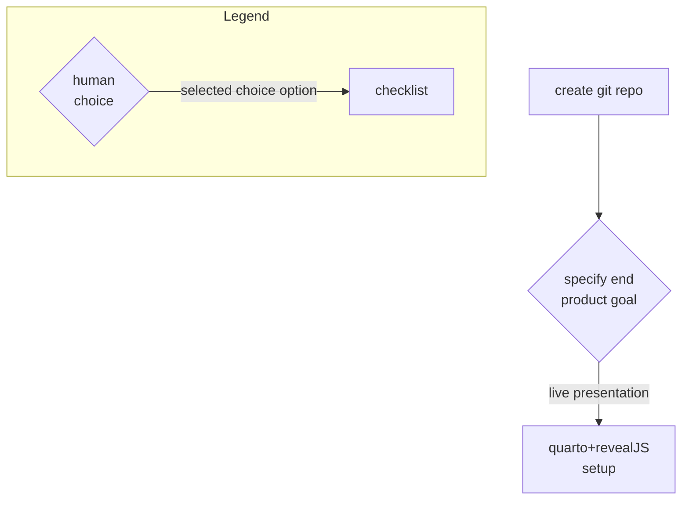

This is an attempt at flowchart-ifying all of my work functions in their most generic form.

```mermaid
graph TD

%% === node definitions =====================================================
init["create git repo"]
projectType{"specify end \n product goal"}
createPresentation["quarto+revealJS \n setup"]
%% db[("cacheDB")]

%% === connections ==========================================================
init -->
projectType -- "live presentation" --> createPresentation

%% === legend ===============================================================
subgraph Legend
    example{"human \n choice"} -- "selected choice option" --> B["checklist"]
end
```
