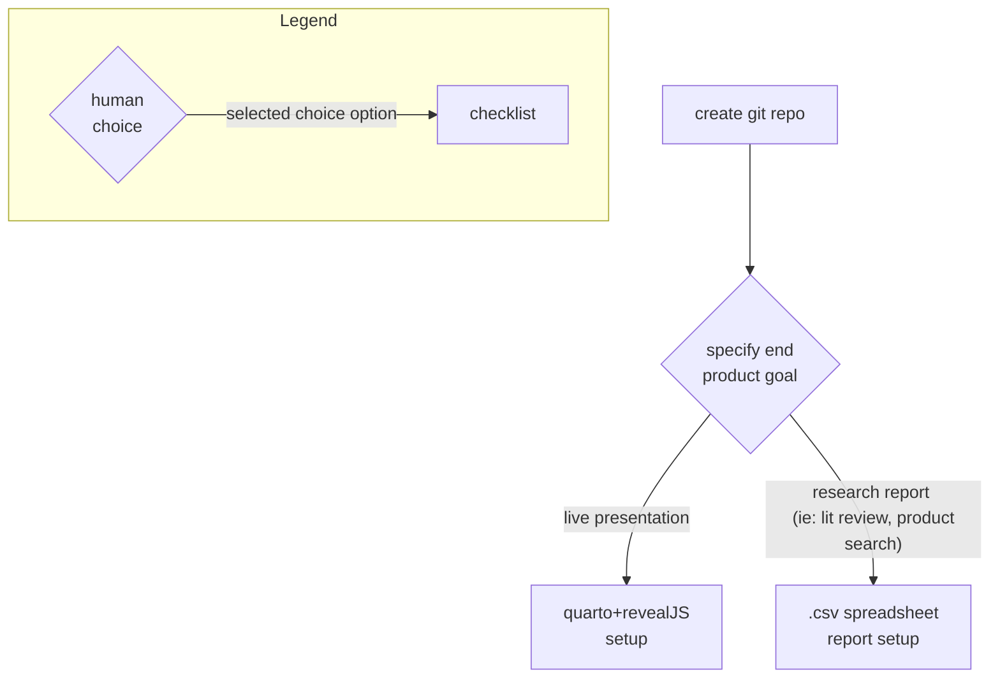

This is an attempt at flowchart-ifying all of my work functions in their most generic form.

reference materials
* quarto inspirations:
  * https://github.com/marinebon/MarineSDMs/tree/main
  * https://github.com/tbep-tech/shiny-workshop/tree/main
